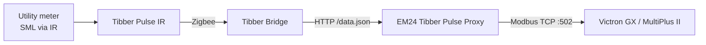

# EM24 Tibber Pulse Proxy

Use a **Tibber Pulse** as the grid meter for a **Victron** ESS system — without installing an
additional Carlo Gavazzi EM24 energy meter in your fuse box.

*[Deutsche Version weiter unten](#deutsch)*

---

## English

### The problem

Victron ESS (Energy Storage System) needs a grid meter to know how much power is currently
flowing to or from the grid. Without it, zero feed-in regulation and self-consumption
optimisation cannot work.

The officially supported meter is the **Carlo Gavazzi EM24**. Installing one means:

* buying additional hardware,
* free DIN rail space in the meter cabinet,
* and in many countries an electrician for the installation.

At the same time many households already have a **Tibber Pulse IR** attached to their official
utility meter. It measures exactly the same value the ESS needs — it just speaks a different
language.

### What this project does

This service reads the live data of the Tibber Pulse from the local Tibber Bridge and
republishes it as a **Modbus TCP server that emulates a Carlo Gavazzi EM24**.

For the Victron GX device nothing looks unusual: it discovers an EM24 on the network and uses it
as the grid meter.



### How it works

1. Every second the service requests `http://<bridge>/data.json?node_id=<id>` from the Tibber
   Bridge. Despite the file name, the response is **not** JSON but a binary **SML** frame
   (Smart Message Language, IEC 62056-5-3).
2. The SML frame is decoded and the following OBIS values are extracted:

   | OBIS | Meaning |
   |---|---|
   | `1-0:1.8.0*255` | energy imported from the grid (Wh) |
   | `1-0:2.8.0*255` | energy exported to the grid (Wh) |
   | `1-0:16.7.0*255` | current active power (W, negative = export) |

3. The values are written into the register layout of an EM24 and served on **Modbus TCP,
   unit ID 1**.

Because the Tibber Pulse only measures the **total** active power, that value is **split evenly
across L1, L2 and L3**. Voltage (230 V / 400 V), frequency (50 Hz) and power factor are plausible
substitute values — the meter does not provide them. This is sufficient for the Victron ESS
regulation, which evaluates the total active power.

> **Note on accuracy:** the per-phase values are calculated, not measured. If you need true
> per-phase metering (for example for phase-exact billing or three-phase load balancing), use a
> real meter.

### Requirements

* A **Tibber Pulse IR** paired with a **Tibber Bridge**, reachable in your local network.
* The **local HTTP interface** of the bridge must be enabled (web interface and
  `data.json` endpoint, protected by HTTP basic auth).
* A **Victron GX device** (Cerbo GX, MultiPlus II GX, Venus OS …) with ESS.
* A host running **Docker** and **Docker Compose**.
* A **free IP address** in your LAN for the emulated meter.

### Why a dedicated IP address?

The emulated meter has to listen on the standard Modbus port **502**. On most servers this port
is either already in use or should not be exposed on the host. The compose file therefore puts
the container on a **macvlan** network: the container gets its own MAC and IP address in your LAN
and behaves like a separate physical device.

Two consequences to be aware of:

* The **Docker host itself cannot reach the container** over that address (normal macvlan
  behaviour). Other devices in the LAN — such as the Victron GX — can.
* Reserve the IP address in your router (DHCP reservation) so nothing else takes it. Because the
  MAC address is pinned in `docker-compose.yml`, the reservation survives container rebuilds.

### Installation

```bash
git clone https://github.com/ixtrader/em24-tibber-pulse-proxy.git
cd em24-tibber-pulse-proxy
cp .env.example .env
chmod +x compose.sh
```

Edit `.env` and adjust the values (see table below). Then start it:

```bash
./compose.sh up --build -d
./compose.sh logs -f
```

Expected output:

```text
INFO: Erste Tibber-Werte vor Serverstart geladen.
INFO: EM24-Modbus-TCP-Server auf 0.0.0.0:502, Unit-ID 1
INFO: Server listening.
INFO: Tibber Pulse: P=-1281 W, Bezug=1324095.5 Wh, Einspeisung=5137706.3 Wh
```

### Configuration

| Variable | Description | Example |
|---|---|---|
| `TIBBER_BRIDGE_HOST` | IP or hostname of the Tibber Bridge | `192.168.1.24` |
| `TIBBER_BRIDGE_PORT` | HTTP port of the bridge | `80` |
| `TIBBER_BRIDGE_NODEID` | node ID of the Pulse (see `http://<bridge>/nodes.json`) | `4` |
| `TIBBER_BRIDGE_USER` | HTTP user of the bridge | `admin` |
| `TIBBER_BRIDGE_PASSWORD` | HTTP password (printed on the bridge) | `XXXX-XXXX` |
| `TIBBER_BRIDGE_LOGLEVEL` | `info` or `debug` | `info` |
| `BUILD_VERSION` | build version; `compose.sh` sets the current short Git hash | automatic |
| `EM24_METER_HOST` | listen address inside the container | `0.0.0.0` |
| `EM24_METER_PORT` | Modbus TCP port | `502` |
| `EM24_METER_ID` | meter ID | `12345678` |
| `EM24_METER_IP` | LAN IP of the emulated meter | `192.168.1.250` |
| `EM24_METER_HOSTNAME` | container host name | `EM24` |
| `EM24_METER_MAC` | fixed MAC address for the DHCP reservation | `22:10:4e:1e:c9:ae` |
| `EM24_NETWORK_PARENT` | LAN interface of the host | `eno1` |
| `EM24_NETWORK_SUBNET` | your LAN subnet | `192.168.1.0/24` |
| `EM24_NETWORK_GATEWAY` | your router | `192.168.1.1` |

Find your interface, subnet and gateway with:

```bash
ip -4 route show default
ip -4 -brief address show
```

### Connecting the Victron GX device

1. **Settings → Modbus TCP/UDP devices → Add device**
2. Enter:

   ```text
   Protocol: TCP
   Address:  192.168.1.250   (your EM24_METER_IP)
   Port:     502
   Unit ID:  1
   ```

3. The device shows up as a Carlo Gavazzi meter.
4. **Settings → ESS → Grid metering:** select the meter as *External meter*.

### Verifying

Show the incoming requests of the GX device:

```bash
docker compose logs -f | grep Modbus-Leseanfrage
```

Dump all implemented EM24 registers with field names:

```bash
docker cp tools/em24_dump.py em24-tibber-pulse-proxy:/tmp/em24_dump.py
docker exec em24-tibber-pulse-proxy python3 /tmp/em24_dump.py
```

### Troubleshooting

| Symptom | Cause / fix |
|---|---|
| `Netzzähler nicht gefunden` in Victron | Register `11` must return `1648`. Check with the snippet above. |
| No `Modbus-Leseanfrage` lines in the log | The GX device never connects. Check IP, port `502` and unit ID `1`. |
| `Connection refused` on `data.json` | Wrong `TIBBER_BRIDGE_PORT`. The bridge usually listens on `80`. |
| `401 Unauthorized` | Wrong user or password of the bridge. |
| `Keinen vollstaendigen SML-Frame erhalten` | Wrong `node_id`, or the Pulse is currently not delivering data. |
| Host cannot ping the container | Expected with macvlan. Test from another device in the LAN. |

### Security

* `.env` contains the bridge password and is excluded via `.gitignore`. **Never commit it.**
* The Modbus server has **no authentication** — that is inherent to Modbus TCP. Only run it in a
  trusted network and never expose port `502` to the internet.
* The service only **reads** from the Tibber Bridge; it never writes to your meter.

### Limitations

* Per-phase values are derived, not measured (see above).
* Reactive power, apparent energy and tariff registers contain plausible placeholder values.
* Update rate is one second — as fast as the bridge delivers new frames.

### License

MIT — see [LICENSE](LICENSE). Copyright (c) 2026 ixtrader.

The EM24 register layout is based on the publicly documented Modbus map of the Carlo Gavazzi EM24
and on experience gained from [`nmakel/solaredge_meterproxy`](https://github.com/nmakel/solaredge_meterproxy).

### Disclaimer

This is a private hobby project and is neither affiliated with nor endorsed by Tibber, Victron
Energy or Carlo Gavazzi. Use at your own risk.

---

<a id="deutsch"></a>

## Deutsch

### Die Aufgabe

Ein Victron-ESS (Energy Storage System) braucht einen Netzzähler, um zu wissen, wie viel Leistung
gerade aus dem Netz bezogen oder eingespeist wird. Ohne diesen Wert funktionieren Nulleinspeisung
und Eigenverbrauchsoptimierung nicht.

Offiziell unterstützt wird der **Carlo Gavazzi EM24**. Dessen Einbau bedeutet:

* zusätzliche Hardware kaufen,
* freien Platz auf der Hutschiene im Zählerschrank,
* und meist eine Elektrofachkraft für die Installation.

Gleichzeitig hängt in vielen Haushalten bereits ein **Tibber Pulse IR** am amtlichen Zähler. Er
misst genau den Wert, den das ESS benötigt — er spricht nur eine andere Sprache.

### Was dieses Projekt macht

Der Dienst liest die Live-Daten des Tibber Pulse von der lokalen Tibber Bridge und stellt sie als
**Modbus-TCP-Server bereit, der einen Carlo Gavazzi EM24 emuliert**.

Für das Victron-GX-Gerät sieht alles normal aus: Es findet einen EM24 im Netzwerk und nutzt ihn
als Netzzähler.


### Funktionsweise

1. Der Dienst ruft sekündlich `http://<bridge>/data.json?node_id=<id>` von der Tibber Bridge ab.
   Trotz des Dateinamens liefert die Bridge **kein** JSON, sondern einen binären **SML**-Frame
   (Smart Message Language, IEC 62056-5-3).
2. Der SML-Frame wird dekodiert und folgende OBIS-Werte werden ausgelesen:

   | OBIS | Bedeutung |
   |---|---|
   | `1-0:1.8.0*255` | Zählerstand Bezug (Wh) |
   | `1-0:2.8.0*255` | Zählerstand Einspeisung (Wh) |
   | `1-0:16.7.0*255` | momentane Wirkleistung (W, negativ = Einspeisung) |

3. Die Werte werden in das Registerlayout eines EM24 geschrieben und über **Modbus TCP,
   Unit-ID 1** bereitgestellt.

Da der Tibber Pulse nur die **Summenwirkleistung** misst, wird dieser Wert **gleichmäßig auf L1,
L2 und L3 verteilt**. Spannung (230 V / 400 V), Frequenz (50 Hz) und Leistungsfaktor sind
plausible Ersatzwerte — der Zähler liefert sie nicht. Für die Victron-ESS-Regelung, die die
Summenwirkleistung auswertet, ist das ausreichend.

> **Hinweis zur Genauigkeit:** Die Phasenwerte sind berechnet, nicht gemessen. Wer echte
> phasengenaue Messwerte braucht (etwa für phasenscharfe Abrechnung oder Schieflastregelung),
> sollte einen echten Zähler verwenden.

### Voraussetzungen

* Ein **Tibber Pulse IR**, gekoppelt mit einer **Tibber Bridge**, erreichbar im lokalen Netz.
* Die **lokale HTTP-Schnittstelle** der Bridge muss aktiv sein (Weboberfläche und Endpunkt
  `data.json`, abgesichert per HTTP-Basic-Authentifizierung).
* Ein **Victron-GX-Gerät** (Cerbo GX, MultiPlus II GX, Venus OS …) mit ESS.
* Ein Host mit **Docker** und **Docker Compose**.
* Eine **freie IP-Adresse** im LAN für den emulierten Zähler.

### Warum eine eigene IP-Adresse?

Der emulierte Zähler muss auf dem Standard-Modbus-Port **502** lauschen. Auf den meisten Servern
ist dieser Port bereits belegt oder soll nicht auf dem Host geöffnet werden. Die Compose-Datei
hängt den Container deshalb in ein **macvlan**-Netzwerk: Der Container bekommt eigene MAC- und
IP-Adresse im LAN und verhält sich wie ein eigenständiges Gerät.

Zwei Punkte sind dabei zu beachten:

* Der **Docker-Host selbst erreicht den Container** über diese Adresse **nicht** (normales
  macvlan-Verhalten). Andere Geräte im LAN — etwa das Victron-GX — schon.
* Die IP-Adresse im Router reservieren (DHCP-Reservierung), damit sie niemand anders belegt. Da
  die MAC-Adresse in `docker-compose.yml` fest vorgegeben ist, bleibt die Reservierung auch nach
  einem Neubau des Containers gültig.

#### IP in der Fritz!Box reservieren

1. `http://fritz.box` öffnen und anmelden.
2. **Heimnetz → Netzwerk** öffnen.
3. Den Eintrag des Containers suchen (erscheint nach dem ersten Start).
4. Auf das Stift-Symbol klicken.
5. **Diesem Netzwerkgerät immer die gleiche IPv4-Adresse zuweisen** aktivieren, speichern.

### Installation

```bash
git clone https://github.com/ixtrader/em24-tibber-pulse-proxy.git
cd em24-tibber-pulse-proxy
cp .env.example .env
chmod +x compose.sh
```

`.env` bearbeiten und die Werte anpassen (siehe Tabelle unten). Danach starten:

```bash
./compose.sh up --build -d
./compose.sh logs -f
```

Erwartete Ausgabe:

```text
INFO: Erste Tibber-Werte vor Serverstart geladen.
INFO: EM24-Modbus-TCP-Server auf 0.0.0.0:502, Unit-ID 1
INFO: Server listening.
INFO: Tibber Pulse: P=-1281 W, Bezug=1324095.5 Wh, Einspeisung=5137706.3 Wh
```

### Konfiguration

| Variable | Bedeutung | Beispiel |
|---|---|---|
| `TIBBER_BRIDGE_HOST` | IP oder Hostname der Tibber Bridge | `192.168.1.24` |
| `TIBBER_BRIDGE_PORT` | HTTP-Port der Bridge | `80` |
| `TIBBER_BRIDGE_NODEID` | Node-ID des Pulse (siehe `http://<bridge>/nodes.json`) | `4` |
| `TIBBER_BRIDGE_USER` | HTTP-Benutzer der Bridge | `admin` |
| `TIBBER_BRIDGE_PASSWORD` | HTTP-Passwort (auf der Bridge aufgedruckt) | `XXXX-XXXX` |
| `TIBBER_BRIDGE_LOGLEVEL` | `info` oder `debug` | `info` |
| `BUILD_VERSION` | Build-Version; `compose.sh` setzt automatisch den kurzen Git-Hash | automatisch |
| `EM24_METER_HOST` | Lauschadresse im Container | `0.0.0.0` |
| `EM24_METER_PORT` | Modbus-TCP-Port | `502` |
| `EM24_METER_ID` | Zähler-ID | `12345678` |
| `EM24_METER_IP` | LAN-IP des emulierten Zählers | `192.168.1.250` |
| `EM24_METER_HOSTNAME` | Hostname des Containers | `EM24` |
| `EM24_METER_MAC` | feste MAC-Adresse für die DHCP-Reservierung | `22:10:4e:1e:c9:ae` |
| `EM24_NETWORK_PARENT` | LAN-Schnittstelle des Hosts | `eno1` |
| `EM24_NETWORK_SUBNET` | eigenes LAN-Subnetz | `192.168.1.0/24` |
| `EM24_NETWORK_GATEWAY` | eigener Router | `192.168.1.1` |

Schnittstelle, Subnetz und Gateway ermittelt man mit:

```bash
ip -4 route show default
ip -4 -brief address show
```

### Victron-GX-Gerät verbinden

1. **Einstellungen → Modbus-TCP/UDP-Geräte → Gerät hinzufügen**
2. Eintragen:

   ```text
   Protokoll: TCP
   Adresse:   192.168.1.250   (eigene EM24_METER_IP)
   Port:      502
   Unit-ID:   1
   ```

3. Das Gerät erscheint als Carlo-Gavazzi-Zähler.
4. **Einstellungen → ESS → Netzzähler:** den Zähler als *externen Zähler* auswählen.

### Prüfen

Eingehende Anfragen des GX-Geräts anzeigen:

```bash
docker compose logs -f | grep Modbus-Leseanfrage
```

Alle implementierten EM24-Register mit Feldbezeichnungen auslesen:

```bash
docker cp tools/em24_dump.py em24-tibber-pulse-proxy:/tmp/em24_dump.py
docker exec em24-tibber-pulse-proxy python3 /tmp/em24_dump.py
```

### Fehlersuche

| Symptom | Ursache / Abhilfe |
|---|---|
| `Netzzähler nicht gefunden` in Victron | Register `11` muss `1648` liefern. Mit dem Schnipsel oben prüfen. |
| Keine `Modbus-Leseanfrage` im Log | Das GX-Gerät verbindet sich nicht. IP, Port `502` und Unit-ID `1` prüfen. |
| `Connection refused` bei `data.json` | Falscher `TIBBER_BRIDGE_PORT`. Die Bridge lauscht meist auf `80`. |
| `401 Unauthorized` | Falscher Benutzer oder falsches Passwort der Bridge. |
| `Keinen vollstaendigen SML-Frame erhalten` | Falsche `node_id`, oder der Pulse liefert gerade keine Daten. |
| Host kann den Container nicht anpingen | Bei macvlan normal. Von einem anderen Gerät im LAN testen. |

### Sicherheit

* `.env` enthält das Bridge-Passwort und ist über `.gitignore` ausgeschlossen. **Niemals
  committen.**
* Der Modbus-Server hat **keine Authentifizierung** — das liegt am Protokoll Modbus TCP. Nur im
  vertrauenswürdigen Netz betreiben und Port `502` niemals ins Internet öffnen.
* Der Dienst **liest** ausschließlich von der Tibber Bridge und schreibt nie auf den Zähler.

### Einschränkungen

* Phasenwerte sind abgeleitet, nicht gemessen (siehe oben).
* Blindleistung, Scheinenergie und Tarifregister enthalten plausible Platzhalterwerte.
* Aktualisierungsrate ist eine Sekunde — so schnell, wie die Bridge neue Frames liefert.

### Lizenz

MIT — siehe [LICENSE](LICENSE). Copyright (c) 2026 ixtrader.

Das EM24-Registerlayout beruht auf der öffentlich dokumentierten Modbus-Beschreibung des Carlo
Gavazzi EM24 sowie auf Erfahrungen aus
[`nmakel/solaredge_meterproxy`](https://github.com/nmakel/solaredge_meterproxy).

### Haftungsausschluss

Dies ist ein privates Hobbyprojekt und steht in keiner Verbindung zu Tibber, Victron Energy oder
Carlo Gavazzi. Nutzung auf eigene Gefahr.
